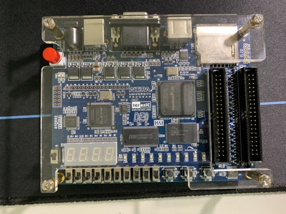
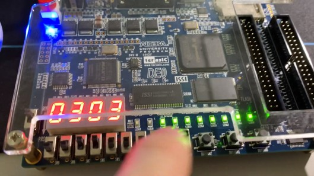
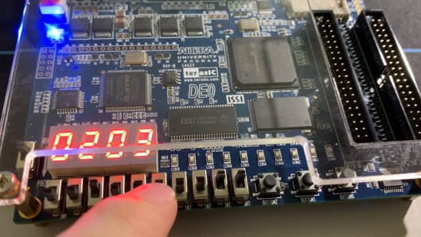

# FPGA Ultimate Password Game (FPGA 終極密碼遊戲)

這是一個基於 **Altera DE0 FPGA 開發板** 的數位邏輯設計專案，使用 **Verilog HDL** 實作了一個雙人互動的「終極密碼」猜數字遊戲。

本專案展示了如何利用 Switch 開關輸入訊號、透過七段顯示器 (7-Segment Display) 輸出數值，並實作硬體層級的數值比較邏輯。

---

## 遊戲規則 (Game Rules)

[cite_start]遊戲由兩名玩家（出題者與猜題者）進行互動 [cite: 1336]：
1.  **出題階段 (Set Password)**:
    * 左方玩家透過 `SW[7:4]` 設定一組 4-bit 密碼 (0~15)。
    * 左側七段顯示器會即時顯示設定的數字。
2.  **猜題階段 (Guess)**:
    * 右方玩家透過 `SW[3:0]` 輸入猜測的數字。
    * 右側七段顯示器會顯示猜測的數字。
3.  **判定與回饋 (Feedback)**:
    * [cite_start]若 **猜測數字 == 密碼**：右側 LED 排燈 (`LEDG`) 全亮，表示猜對 [cite: 1340, 1344]。
    * 若 **猜測數字 != 密碼**：LED 保持熄滅。
    * [cite_start]出題者隨時可調整開關設定新密碼，LED 即時熄滅，開始新的一局 [cite: 1337, 1345]。

---

## 技術與硬體 (Tech Specs)

* **Hardware**: Altera DE0 Development Board (Cyclone III FPGA).
* **Language**: Verilog HDL.
* **I/O Mapping**:
    * **Input**: 8x Slide Switches (`SW0`~`SW7`).
    * **Output**: 2x 7-Segment Displays, 10x LEDs.

---

## 模組設計 (Module Design)

[cite_start]系統由三個主要模組構成 ：

### 1. 數值比較器 (`compare`)
[cite_start]這是遊戲的核心邏輯。接收兩個 4-bit 輸入 (`a`, `b`)，若兩者相等，則輸出全亮的 LED 訊號；否則輸出全暗訊號 。

```verilog
module compare(a, b, LEDC);
    //若 a 等於 b，LED 全亮 (8'b11111111)
    if(a == b) LEDC = 8'b11111111;
    else LEDC = 8'b00000000;
endmodule
```


---


### 2. 七段顯示解碼器 (Sevenseq2)
* [cite_start]負責將 **4-bit 二進位數值** (0000~1111) 轉換為七段顯示器的 **16-bit 控制訊號** (控制兩個 digit) [cite: 1341]。
* [cite_start]使用 `case` 語句建立查找表 (Look-up Table)，例如輸入 `4'b0000` 對應顯示 `0` [cite: 1341]。

### 3. 頂層模組 (FinalProject)
* [cite_start]負責將上述模組與硬體腳位進行連接 (Instantiate) [cite: 1346]。
* [cite_start]連接 `player1` (出題者開關) 與 `player2` (猜題者開關) 至解碼器與比較器 [cite: 1346]。

---

## 實作演示 (Demo)

### 硬體配置

*(左側顯示出題數字 3，右側顯示猜題數字)*

### 遊戲成功 (Match)
當右側玩家猜中數字 3 時 (`SW[3:0] == SW[7:4]`)，上方 LED 燈亮起慶祝。


### 遊戲重置 (Reset)
當出題者更改題目為 2 時，條件不再相符，LED 自動熄滅，等待下一次猜題。


---

## 專案文件
* [Verilog 原始碼 (finalproject.v)](./src/finalproject.v)
* [專案簡報 (Project_Presentation.pptx)](./docs/Project_Presentation.pdf)
